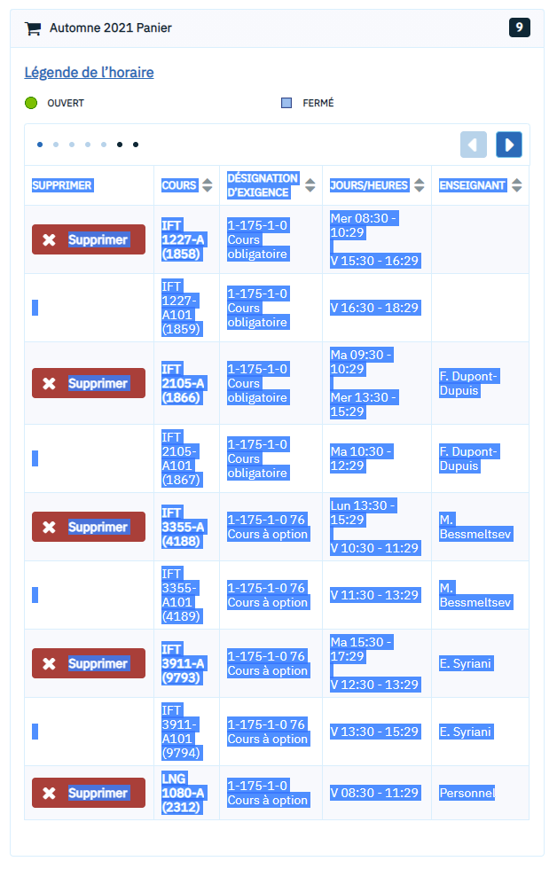
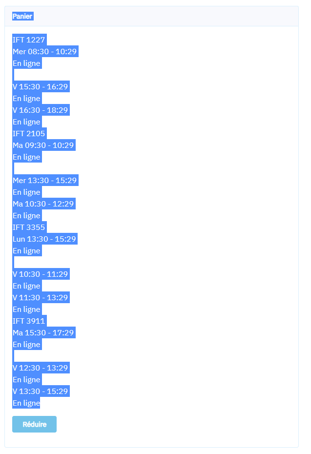

# Outil de Visualisation de Panier - alpha

Pour finalement pouvoir visualiser les cours dans le panier, sans avoir à les ajouter à l'horaire. 

**À utiliser avec précaution - pourrait bugger à certaines places.**


## Table de matières

- [Comment l'utiliser](#comment-lutiliser)

- [Utilisation 1: Panier sur "inscriptions"](#Utilisation 1: Panier sur la page inscriptions)
- [Utilisation 2: Panier sur la page de sélection d'un cours](#Utilisation 2: Panier sur la page de sélection d'un cours:)

- [Remerciements](#Remerciements)

## Comment l'utiliser

#### Pre-réquis: 

- [Python 3.8 ou plus récent](https://www.python.org/downloads/)(autres versions peuvent marcher, mais pas garanti)
- Git (optionnel)
- Un ordinateur 
- Un minimum de joie de vivre 

#### Linux/Windows/Mac

1. Ouvrir une ligne de commande 

2. Télécharger le code sur ce répo, soit par 

   ```
   git clone https://github.com/Laurasalas96/Centre-Etudiant.git
   ```

   ou en téléchargeant manuellement 

3. Être sur que la ligne de commande est à l'endroit ou le fichier a été téléchargé. 

4. Écrire sur la ligne de commande:

   ```
   python scheduler.py
   ```

5. Utiliser une des deux options ci-dessous pour coller votre panier, sur la ligne de commande, et puis appuyez sur la touche "enter"/"retour" 3 fois. 

## Utilisation 1: Panier sur la page inscriptions



Sélectionner du coin inférieur droit jusqu'au coin supérieur gauche. 

## Utilisation 2: Panier sur la page de sélection d'un cours:



Sélectionner de la dernière ligne du dernier cours jusqu'au mot "Pannier". 


## Remerciements

1. Mon chat
2. mes amis qui m'ont carry cette session 
